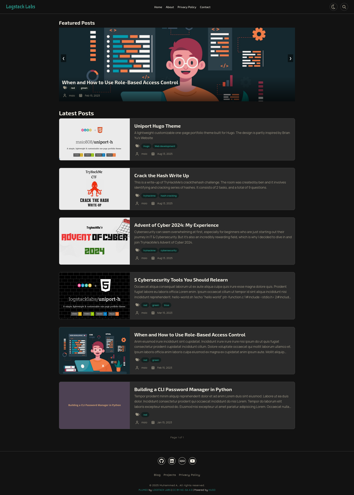
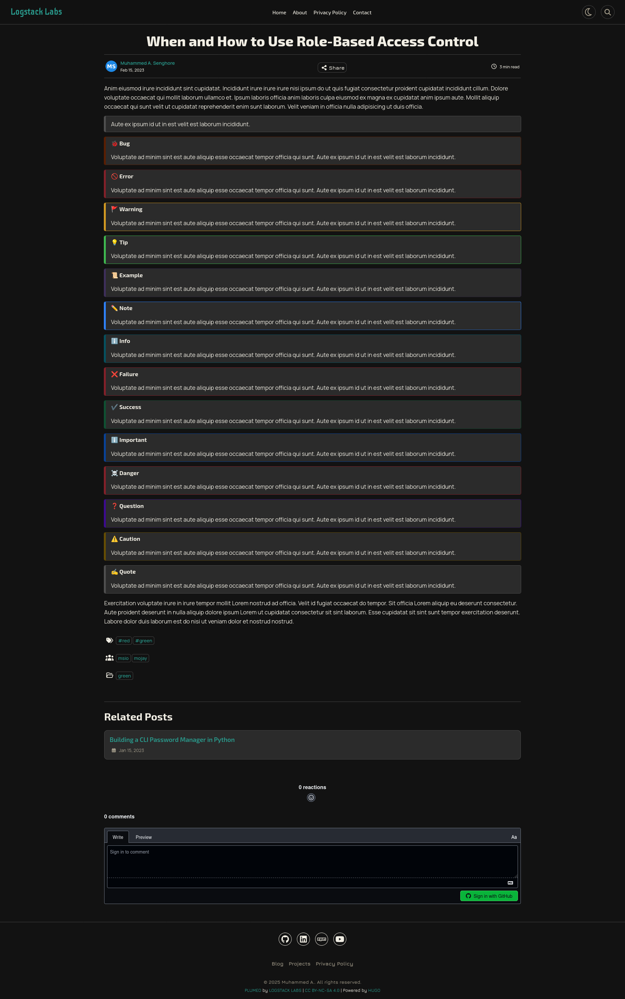
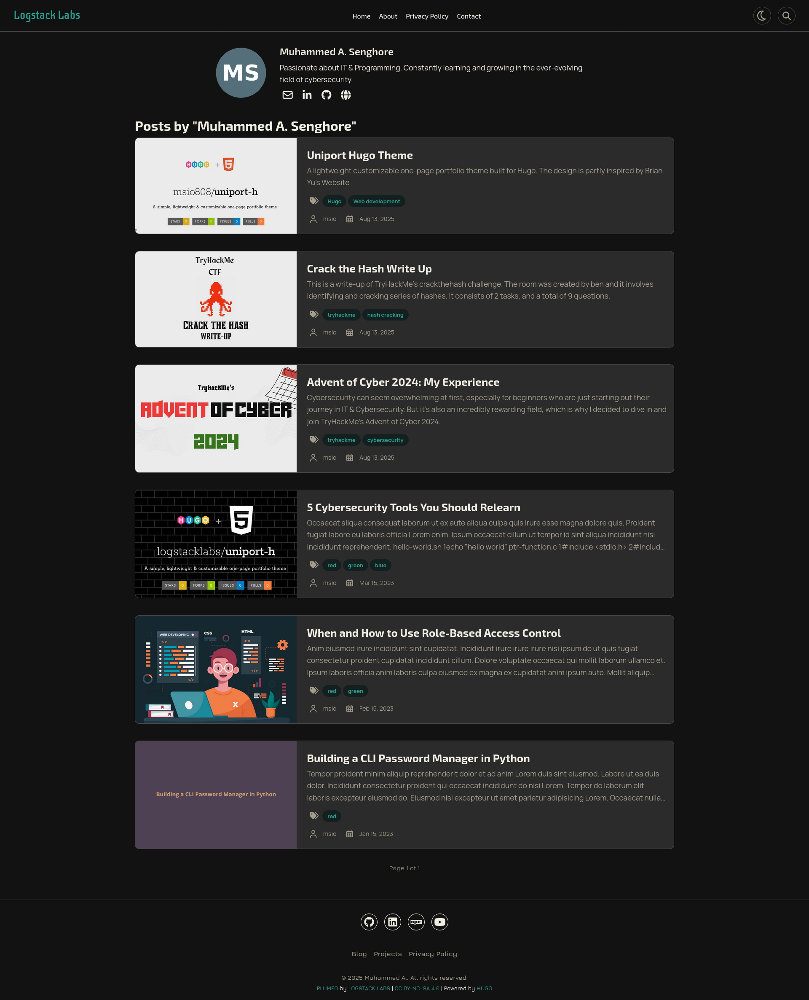
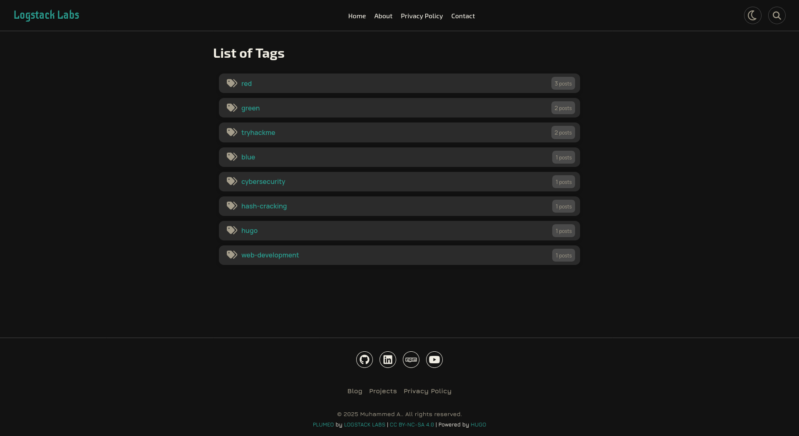

<div align="center">
    
    <h1>Plumeo 🪶 <small>v0.1.0</small></h1>
</div>

Plumeo is a clean, lightweight and responsive **Hugo theme** designed for writers, developers, and creators who want a **minimalist, and elegant blog**.

## ✨ Features

* 📱 Responsive & mobile-friendly layouts.
* ⚡ Minified assets, lazy-loaded images, google fonts, and assets fingerprinting.
* 📰 Clean & optimized layouts and typography.
* 🏷️ Taxonomy support including categories, tags, and author pages with post counts and icons.
* 📖 Custom render hooks for codeblocks, Images, & blockquotes with 15 different Github styled alerts.
* 🔎 Built-in search functionality.
* 🖼️ Local & Remote image resource handling.
* 📂 SEO friendly (Schema.org markup, Open Graph, Twitter cards, & social meta tags).
* 🔗 Social Share buttons for different social platforms including (Linkedin, Facebook, Mastodon, BlueSky, Threads, WeChat, etc...).
* 🧩 Shortcodes currently has only the contact form & card, more shortcodes will be included in future updates.

## 📸 Screenshots
<ul>
    <li>
        <details>
            <summary>Homepage</summary>
            
        </details>
    </li>
    <li>
        <details>
            <summary>Post Page</summary>
            
        </details>
    </li>
    <li>
        <details>
            <summary>Taxonomy (Terms)</summary>
            
        </details>
    </li>
    <li>
        <details>
            <summary>Taxonomies</summary>
            
        </details>
    </li>
</ul>

## 🚀 Demo
- [blog](https://logstack.dev/blog)

## 🛠️ Installation

Inside the `themes/` directory of your Hugo site, add as submodule:

```bash
cd themes
```
```bash
git submodule add https://github.com/logstacklabs/plumeo.git themes/plumeo
```

Or clone the repo
```
git clone https://github.com/logstacklabs/plumeo.git themes/plumeo
```

## ⚙️ Configuration

Enable the theme in your `hugo.toml`:
```toml
theme = 'plumeo'
```
#### SEE: [the blog](https://logstack.dev/blog/plumeo) for all the configurations:

- To work on Plumeo locally:
  ```shell
  hugo server
  ```
- To build your hugo site
    ```shell
    hugo
    ```
- Preview your site at [localhost:1313](http://localhost:1313).
- To update, run the following commands:
    ```shell
    cd themes/plumeo
    ```
    ```shell
    git pull origin main
    ``` 
    ```shell
    cd ../..
    ```
    ```shell
    git submodule update --remote --rebase
    ```

## 🤝 Contributing
[](CODE_OF_CONDUCT.md)
- Check out this guide [link](https://daily.dev/blog/how-to-contribute-to-open-source-github-repositories)
- Also makesure to record your changes in the [changelog](CHANGELOG.md) file.

## 📜 License

This project is licensed under the Creative Commons Attribution-NonCommercial-ShareAlike 4.0 International License.

[](https://creativecommons.org/licenses/by-nc-sa/4.0/)

## 🙏 Acknowledgements
- **[HUGO](https://gohugo.io)**
- **[Web3Forms](https://web3forms.com)**
- **[Font Awesome](https://fontawesome.com/)**
- **[Google Fonts](https://fonts.google.com)**
- **[EON Color Palette](https://logstacklabs.github.io/eon-swatches/)**

### 💝 Support

For any issues or questions, please [open an issue](https://github.com/logstacklabs/plumeo/issues) on GitHub.

<!--## 🧭📝🎨🌐-->